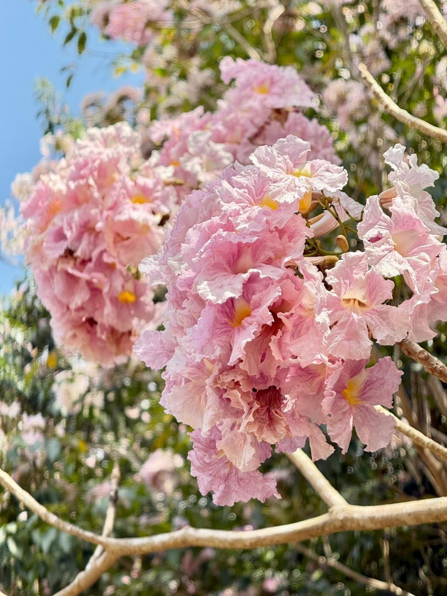

# Queen's Flower / Pride of India (`Lagerstroemia speciosa`)

| Field Attribute | Taxonomic / Ecological Specification |
| :--- | :--- |
| **Catalog ID** | `FL-56` |
| **Common Name** | Queen's Flower / Pride of India / Giant Crape-myrtle / Jarul |
| **Scientific Name** | *Lagerstroemia speciosa* |
| **Botanical Family** | `Lythraceae` |
| **Category** | Plant (Deciduous Flowering Canopy Tree) |
| **Location of Observation** | **Near AB-3** |
| **Microhabitat** | Landscaped academic road margin / Sunny open lawn border |
| **Trophic Level** | Primary Producer (Trophic Level 1) |
| **Contributing Survey Team** | **Team Thuliyan** |
| **Survey Source** | Assignment 2 Survey (Team Thuliyan) |

---

## Field Observation Photograph

---

## Botanical & Morphological Description

A magnificent deciduous to semi-evergreen tree with smooth greyish flaking bark and elliptic to oblong-lanceolate leathery leaves. Renowned for its spectacular, voluminous terminal panicles of crinkled, 6-petaled flowers in vivid shades of pink, rose, and mauve-purple, blooming profusely in full sun. Followed by woody, subglobose 6-valved dehiscent seed capsules.

---

## Ecological Role & Campus Interactions

- **Trophic Role**: Primary Producer (Trophic Level 1)
- **Ecosystem Service**: High-value ornamental and shade tree that enriches campus aesthetic biodiversity, provides nectar and pollen resources during flowering flushes, and cools surrounding academic paved pathways.
- **Inter-species Interactions**:
  - Showy crinkled blossoms attract pollinating carpenter bees, honeybees (*Apis cerana*), and butterflies.
  - Woody capsules and spreading branches provide perching and nesting canopy for campus avifauna.

---

[Back to Flora Index](../README.md) | [Back to Campus Inventory Root](../../README.md)
